<div align="center">
  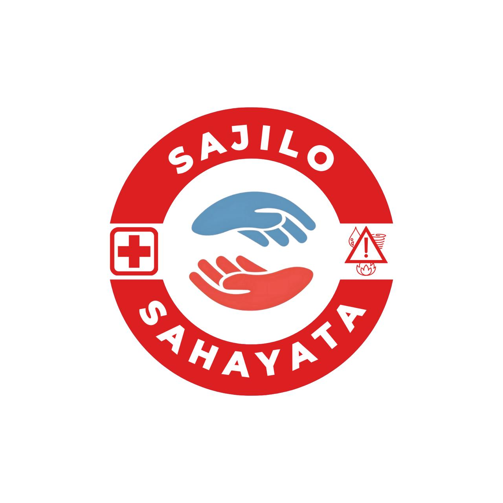
  <h1>🌐 Sajilo Sahayata</h1>
  <p><strong>A Community-Driven Disaster Reporting and Coordination System</strong></p>
  <p><em>From Alert to Action Instantly</em></p>

  <a href="https://github.com/TechVerse2025/sajilo-sahayata">
    
  </a>
  <a href="https://github.com/TechVerse2025/sajilo-sahayata/blob/main/LICENSE">
    
  </a>
  <a href="https://github.com/TechVerse2025/sajilo-sahayata/issues">
    
  </a>
  <a href="https://github.com/TechVerse2025/sajilo-sahayata/stargazers">
    
  </a>

  <p>A flagship open-source project by <strong><a href="https://github.com/TechVerse2025">TechVerse2025</a></strong></p>
</div>

---

## 🎯 About the Project

In times of crisis, every second counts. **Sajilo Sahayata** is a real-time disaster management platform designed to bridge the critical gap between an incident and an effective response. Developed under the **TechVerse2025** initiative, our mission is to empower citizens, first responders, and government agencies with the tools they need for **faster alerts**, **smarter coordination**, and **life-saving actions**.

The system intelligently detects a user's location to provide area-specific alerts and emergency contacts, ensuring that help is always accessible, no matter where you are.

---

## ✨ Key Features

-   **Real-Time Alerts:** Instant notifications to authorities and nearby citizens.
-   **Interactive Geospatial Mapping:** Visualize incident types, locations, and clusters on a live map powered by Leaflet.js.
-   **Role-Based Dashboards:** Separate, secure interfaces for citizens (reporting) and administrators (management and analytics).
-   **Data-Driven Insights:** An advanced admin panel with charts and visualizations to analyze incident patterns and resource allocation.
-   **Secure Authentication:** Robust sign-up and login system for all users.
-   **Multi-Language Support:** Built to be accessible to diverse local communities.
-   **Location-Aware Customization:** Dynamically displays relevant alerts and contacts based on the user's current location.

---

## 🛠️ Tech Stack

-   **Frontend:** React.js 18, Vite, Tailwind CSS
-   **Backend:** Node.js, Express.js
-   **Database:** MongoDB
-   **State Management:** Zustand
-   **Maps & Visualization:** Leaflet.js, Chart.js

---

## 🚀 Getting Started

Follow these steps to set up and run the project locally.

### Prerequisites

-   Node.js `v18+`
-   npm `v9+`
-   MongoDB (A local instance or a [MongoDB Atlas](https://www.mongodb.com/cloud/atlas) connection string)

### Installation & Setup

1.  **Clone the repository:**
    ```bash
    git clone [https://github.com/TechVerse2025/sajilo-sahayata.git](https://github.com/TechVerse2025/sajilo-sahayata.git)
    cd sajilo-sahayata
    ```

2.  **Set up the Backend:**
    ```bash
    cd backend
    npm install
    ```
    Create a `.env` file in the `backend` directory and add the following variables:
    ```env
    PORT=3000
    MONGO_URI=your-mongodb-connection-string
    JWT_SECRET=your-super-secret-key
    ```
    Now, run the backend server:
    ```bash
    npm run dev
    ```

3.  **Set up the Frontend:**
    *(Open a new terminal window for this step)*
    ```bash
    cd frontend
    npm install
    npm run dev
    ```

4.  **Access the Application:**
    Open your browser and navigate to `http://localhost:5173` (or the port specified by Vite).

---

## 🖼️ Screenshots

<details>
  <summary><strong>📱 User View (Click to Expand)</strong></summary>
  <br />
  <div style="display: flex; flex-wrap: wrap; gap: 10px;">
    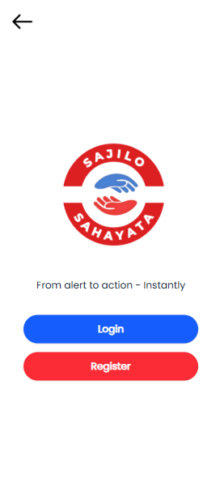
    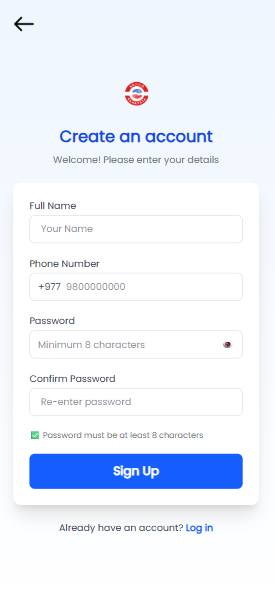
    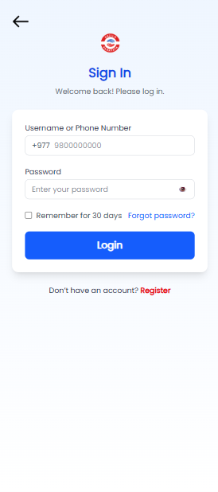
    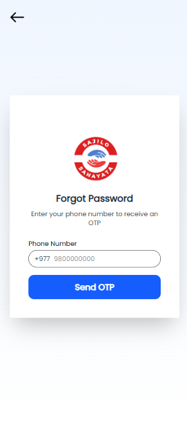
    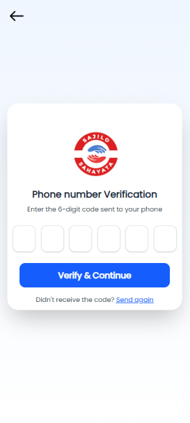
    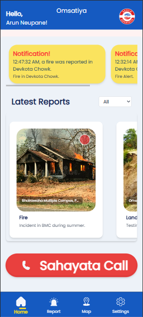
    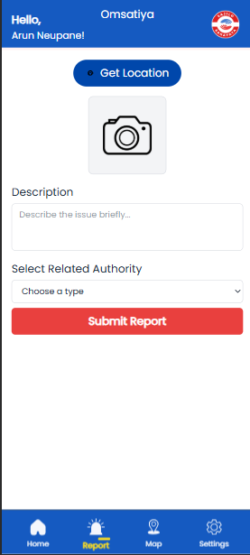
    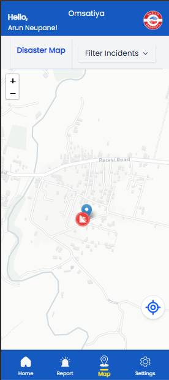
    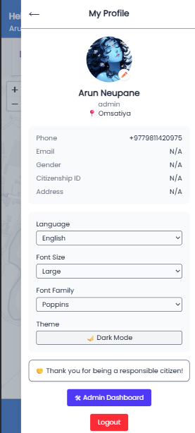
  </div>
</details>

<br />

<details>
  <summary><strong>🖥️ Admin Panel (Click to Expand)</strong></summary>
  <br />
  <div style="display: flex; flex-direction: column; gap: 15px;">
    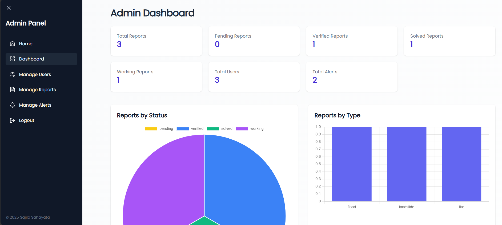
    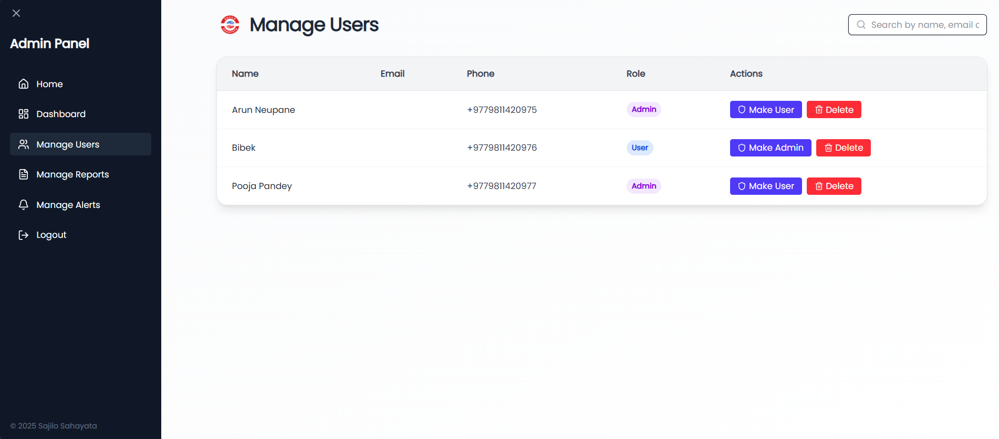
    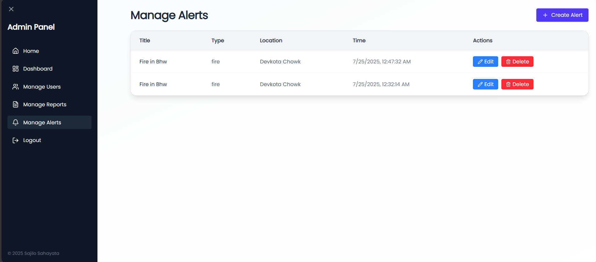
    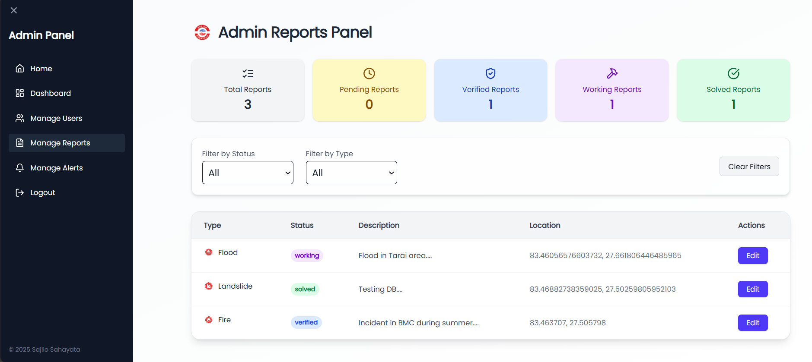
    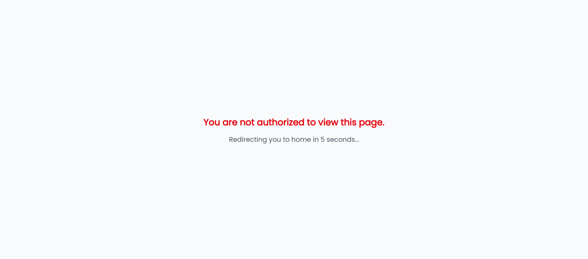
  </div>
</details>

---

## 🤝 Contributing

We welcome contributions from the community! Whether you're fixing a bug, adding a feature, or improving documentation, your help is valuable.

To contribute:
1.  Fork the repository.
2.  Create a new branch: `git checkout -b feature/YourAmazingFeature`
3.  Make your changes and commit them: `git commit -m 'Add some amazing feature'`
4.  Push to the branch: `git push origin feature/YourAmazingFeature`
5.  Open a Pull Request.

For major changes, please open an issue first to discuss what you would like to change.

---

## 📜 Project History & Acknowledgements

**Sajilo Sahayata** was born as a Final Year Project for the BSc.CSIT program and proudly won the **BMC InnovateX** hackathon. Its success demonstrated the power of technology in emergency response. It has since been adopted by **TechVerse2025** as an open-source initiative to foster further development and real-world impact.

We extend our heartfelt gratitude to the founding teams for their vision and foundational work.

#### 🔹 Initial Prototype – _Team Emergex_
-   **Aayush Chapagain** – UI/UX Design & Project Manager
-   **Arun Neupane** – Frontend Development
-   **Barsha Panthi** – UI/UX Design & Research
-   **Bibek Bhusal** – Backend Development

#### 🔹 Further Development – _Team BigAh_
-   **Arun Neupane** – Full-Stack Development
-   **Bijay Chaudhary** – Documentation & Reports
-   **Sunil Paudyal** – Logistics & Coordination
-   **Supervised by:** Mr. Suraj Pandey

---

## 💬 Community & Support

-   **Report a Bug:** If you find a bug, please [open an issue](https://github.com/TechVerse2025/sajilo-sahayata/issues).
-   **Request a Feature:** Have an idea? [Start a discussion](https://github.com/TechVerse2025/sajilo-sahayata/discussions).
-   **General Questions:** Join our community for help and collaboration.

---

## 📄 License

This project is licensed under the **MIT License**. See the `LICENSE.md` file for details.

---

<div align="center">
  <p><strong>Sajilo Sahayata</strong> — A commitment to building safer communities through technology.</p>
</div>